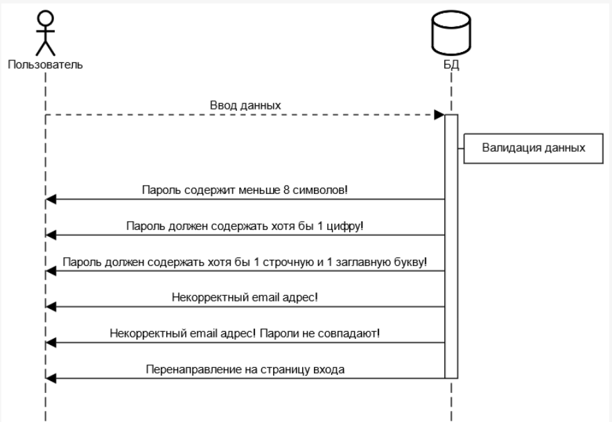
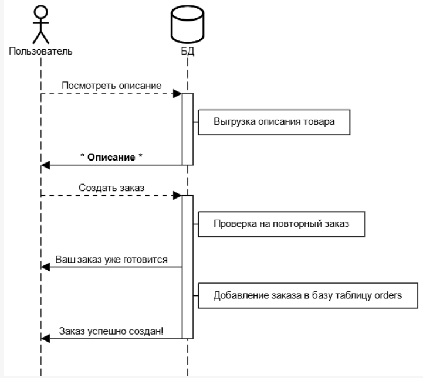
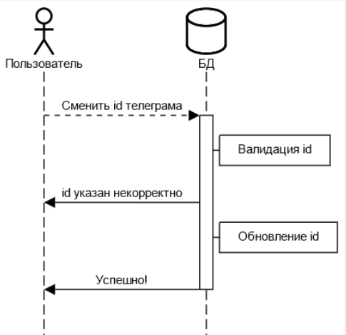
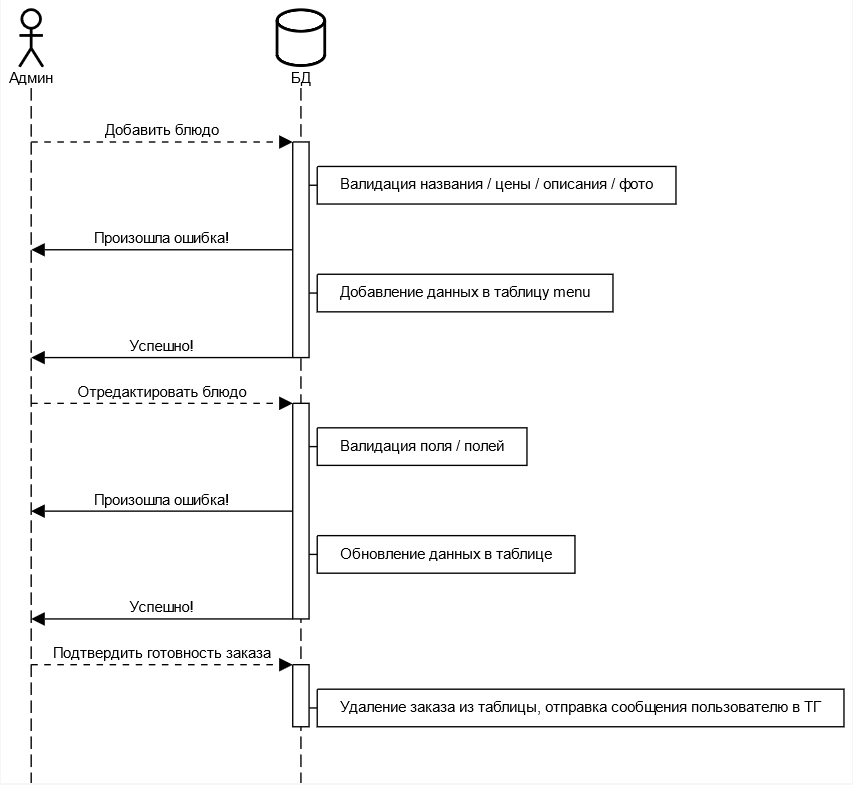
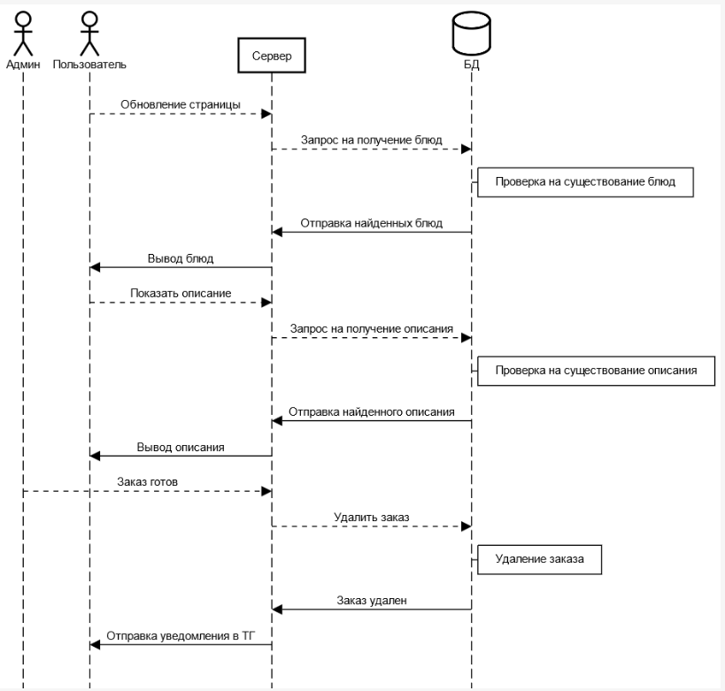

# Ресторан
***
## Цель работы
Разработать и реализовать систему ресторана.
***
## Задание
Система предназначена для выбора блюд, составления заказа, получения номера очереди и отправки сообщения о готовности заказа посредством телеграм бота. Админский интерфейс позволяет добавлять/редактировать каталог блюд и подтверждать выдачу заказа.  
  
#### Возможности пользователей:  
  
- добавление блюд в корзину
- удаление блюда/очистка корзины
- просмотр описания блюд
- создание заказа
- просмотр очереди
- получение уведомления о готовности заказа в ТГ бота  

#### Возможности админа:
- добавление/редактирование блюд (название, цена, описание, фото)
- подтверждение готовности заказа
***
## Ход работы
- Разработать пользовательский интерфейс
- Описать сценарии работы
- Описать API сервера и хореографию
- Описать структуру БД и алгоритмы обработки данных
- Написать программный код
- Удостовериться в корректности кода
***
### 1. [Пользовательский интерфейс](https://www.figma.com/file/4pfM730zqA0hlpp5oTBuxK/%D0%9A%D1%83%D1%80%D1%81%D0%B0%D1%87?node-id=5%3A291&t=IiPEcpmihOjE7u12-0)
***
### 2. Cценарии работы 
**а) Вход**


***
**б) Регистрация**



**в) Меню**



**г) Профиль**



**г) Админ панель**


***
### 3. API сервера и хореография


***
### 4. Структура базы данных
Таблица ***users***
| Название | Тип | NULL | Описание |
| :------: | :------: | :------: | :------: |
| **id** | INT  | NO | Автоматический идентификатор юзера |
| **first_name** | TEXT | NO | Имя |
| **last_name** | TEXT | NO | Фамилия |
| **email** | TEXT | NO | Почта |
| **tg_id** | BIGINT | NO | ID телерама |
| **pass** | VARCHAR(60) | NO | Пароль |
| **status** | BOOL | NO | Админ / Юзер |

Таблица ***menu***
| Название | Тип | NULL | Описание |
| :------: | :------: | :------: | :------: |
| **id** | INT  | NO | Автоматический идентификатор блюда |
| **title** | TEXT  | NO | Название блюда |
| **description** | TEXT | NO | Описание блюда |
| **price** | REAL | NO | Цена блюда |
| **file_path** | TEXT | NO | Путь к фото |

Таблица ***orders***
| Название | Тип | NULL | Описание |
| :------: | :------: | :------: | :------: |
| **user_id** | INT  | NO | Идентификатор заказчика |
| **products** | TEXT  | NO | Блюда |
| **amont_products** | INT | NO | Кол-во блюд |
| **total_price** | INT | NO | Общая стоимость заказа |

***
### 5. [Алгоритмы](https://viewer.diagrams.net/?tags=%7B%7D&highlight=0000ff&edit=_blank&layers=1&nav=1&title=%D0%90%D0%BB%D0%B3%D0%BE%D1%80%D0%B8%D1%82%D0%BC%D1%8B#R7V1bc6M4Fv41XfMUF5K4PjqJM5vanp7eTrZ25hHb2GHGNl4bdyf761dgBEISRmCEsNvdVY4BWYB0dC7fuegTeli%2F%2F7rzt2%2B%2FRfNg9Qka8%2FdP6PEThCaCDv6TnPk4ngGOnZ1Z7sJ5dq448RL%2BL8hOGtnZQzgP9qWGcRSt4nBbPjmLNptgFpfO%2Bbtd9KPcbBGtynfd%2BsuAO%2FEy81f82f%2BE8%2FjteNYl75Wc%2F0cQLt%2FInYHtHa%2BsfdI4e5P9mz%2BPflCn0OQTethFUXz8tn5%2FCFbJ6JFxOf7uqeJq%2FmC7YBPL%2FOBw%2BPtgTf96msDxj6%2F%2FXL%2BMfw2%2B3sFjL9%2F91SF74exh4w8yAsFmPk4GEh%2FNVv5%2BH84%2Bofu3eL3CJwD%2BuosOm3mQ3MTAR%2Ft4F%2F0dPESraJf%2BHBmGaxnJlUW0ibP5BcnvFuFqRbV7ejKMtN3xAYI5Ny%2FFi4J8%2BDDhBdE6iHcfuMmPYoKsbNDfqLkh53bByo%2FD7%2BXu%2FYxOlnl3%2BR2%2BRiG%2BMTQyor4Dnn38TUbTyHZGyYdhWul%2Fu9zjPjrsZkHWCT0%2FbL%2BmUeoWkmPSUezvlkHMdYQnx%2F%2Bgmm2TBvsTz%2B9wj3%2F6uZj25Lmy9vjL8QnIETUlxamUFhvQJbrR5dl06cAyXbrd0KVt9EOXDmxGl%2BS5lNKlWU%2BXmM9vk6%2BLVfCeEeh9M1plKHBhJf%2Fx%2BeXOn4eY2Khr0%2FS%2FiL7t9N8F0C2ADN9D3shyvOIfake30GjHT7siFUtAKvYKj939PPxeIhn7v4dECUg50d0%2BZUVj3ACA7Xs6f%2BQ6%2FrZM%2F2Iq8WDyeW%2Bkn%2BmZezf9NMl58Mm1yXn8%2FQn3WG6APx%2FJJ25wn35a5CHxO6fPmd2SpfLdW7SeHvBI3v94C%2BPgZevPkis%2FsBp4irT9VbjcJKsA016wE9D6YgFnMzGtLxZzL6Vojtbn9tS2Clr%2FHuzi4L0ptVeRDTmmVgOwBcvBNaopv0RbTQnJriSkqRQZwVNk9JRSwISQEaaAh%2FS7Q52HFEkdv1vl9vgTpGfGFCF6hOAg9TnJSFCWFulm9xQd4y8G9SSIInRAnjNvwyyG9JOM4K6g8Jzup5VUT3g7Jid%2FtQpWESbTNW64DXYhnuyEosvXvhYX6hbKInwPiAEkkAmntZROZMRZ6%2BbOklg3bp%2FrxmnMgAVrJPtFtGLPrEL2zH7rb4TdTv3Z38t0Ou9mx8FP1mW4CePQX1UuzbGVku1xQbgUgRuipZkvIDdbFtnSeaJWAP3DfDHlVH98fG4x8O95CW%2BecySL8CWaY%2BR87JHqEGXfSz%2B%2FF9xxiEPmIeptH6n3FHJAmo0CbmTH5D0NEVfNe3a4OzKKxkWS3iNHLwb3ho0WIC39LEqa0QN3QuidkI0PpOWYPE8%2BQxPynMf2DENghKdJ%2FYSeZvr5yZwln%2BRGGQEhsnqYkXGyqxUy%2FOVfn8klh7rdU7mffCG2Wnb4JM%2B46xTbktitkdmcRHXhFKUStUZez63AnZuUQrwKFsXjnCWIEWNPubwczk2hXuSwy8nhh2%2BT8WvCaV%2FH95%2BTv88JRXz5%2FRV%2FTv54fnl9GY1G583M3N%2B%2FpW2F02QYGajDTlMH4%2B8yBgQQKULwhD3d%2BQR43AQ8f3mZfEtG%2B%2FnL6%2B8XPNaePbSxJn4LGqicL4OX7DDaxW%2FRMtr4q0lxllH1izafo2ibDetfQRx%2FZKPnH%2BKoPAPBexj%2Fkfx8ZGVHf1JXHt%2BzntODjwqLQhYnwu%2BWIjD1BHcEWOra8ZMrDSidN1NAYB90juUJlkOCKAvGXzyHxsk5xDOz%2B%2FiDPviz6CE5LH6WHuVzX5ZG%2BTN1SAOWJA04YhroB3uEDsM%2FPKvchTTY6IqFbscYOXsbUPb5qcG8gYSTsM%2BFci7x6iI2ixVW0Bw50Mj%2FwZa0Z5t8vx4o%2BkXMkyrGvYGE7%2B5GLvXk4kF%2BWi27cIs4oB25cDoTS3eq6aMXH9r59FHI1kKc5hL5hGxNjyjcN5faTRW0rhUybQ4%2Bg5NaZUr2zHaUDAzOddgzKVf7%2BH5e18yxw7QN3W0JxLm5XVS5XXIlQ5vbBYj8laxJfB4vz2NyrkXWc5wMsEE2rXmiLWeJdMYSBV63hJmZFDMAFGvJ4WXel0Cj1mOKzUwo90PipfglwKS0%2B6VgPqwDKMe1AQXiU46eUvsJB6bTTg%2FIoeSQgOD5k3nUy%2BScdlJ2ZuWjMKZuihvb%2FjrhT5vpfts9OD11LdOS4WruLEiDMDrgT56IH4kQOZZOu%2BNHPP6snR%2Fl6iCN9OSqYR3W00wf7VCNJIu7FtRxTZ3clEfg2%2FHSO4vhpUgNqsMG%2Flqnn8p0hE%2BlFgPifQiVWtot8FFS6DPUZXle2cBvR7VsAFvSrecW3TJhwIr1AfKOtzDIyw6DFNoVvYZBwoH5ay7V1kC2gO04FAzdju2YLmt39Gt4EGoYQMoIr%2BY1QP0oNc80bVrRuzNGyey0QB87VAGRrF%2FPtvTKVpBQdVkNZBMA5PVARkMzFaVmAQjFN6pcdM2a37GL1Owjlwt2nsxVs%2F4CC0%2F1aUNNvTFVu0CgVhuJ9SRzclt2cbDhZvlx67XRuWQQOJxukJQWSIpduCcgKnWQFKvaIlnVVhlEBUV%2BpBuHhPaQOKTdVn1gOaR9dnBQ5xxS4LK5ccgbh8xTsZFuDol4HfJl8nny8HrBwcusMm45glHuNXgZXUhojqyM0SU6bA6CNbuAWGyWYNhoVcUQCxKoKarFxP4wmwX7fQtBcQ5TOD%2BvpwP%2BAACX3WDJMQhWU%2BmOQaiP7WgOsrWMge9QUUV6sS4%2Bvq5lJDEAiBH8PTMYcfDImFbynArvTVX2L88e0k9olBkVnzqZNxbG29Feo%2FwqnUJskATYcwL4nq6AjXFSy5bkYsqUSRsKuFiHPkkmh5WxRmihlydZP5JD1pZQkuWc366Qzy4lePOlVJdxW%2FKMdjSAit64SsnILT7xwF%2F6u1NmNnwq61ONXpDlQtfq9r5DoFxVzLIERpkn4FZcxGZ37ErCf5JQxbby%2FbPimP6UNDcaj4vFBB3loVF0WrkhGhdH2bhIWKuNyJMPJZq5wXQhIS79wF1U0K0T%2BHaQ9k7qfxqypHqCGk7qmn3PQ3UWxBsgLOQZj%2FM7xV2KK%2BTkVsjyeJb2OdoF6%2BSZtvtD8neejjX%2BbZhosj5%2Bp2NpDEz0e0z0QXxIruJ52YbYFgk3y0TrX4VZqz2e%2FaSP5GR42K%2Bj5DAO1tu0z3AzC%2Bfh%2FJAqyYfkY%2BVP8f2T1jG5d3K09pcbP7nNKvzvwR9RL7qtZKJ46uNT%2Btom2gQMrWWnMMdOXwQ9WsXRa5orngRciblyhKltsUop8C2cz4MNR%2F8slXPsWjcJ28bIRKxN0h0dS8Q4nm3cygUKNy46KhG5oTcg4w4ygtVmUUzpaAxWRPcdaUQY6QBAkMJbd16kkXN%2BhmOXlJqNZ33tAL0Fd%2FPA8iIbvy1Nc4UIQM95OySbmMV2IVVDis8T5B1wRwiYcagx5cEqPApx%2BkcO0yC12JNwuKNlhakYePzKoiVWO8dDJnOlxF2NEg2ZCs22J4BCRJLPViXzHBEU0iEvmwcL%2F7CKFUg8baseQMZC9LyRo6%2FMdlcMwBWFV99AsZ8SFKsc8oq3VgFY3eApGXgqh6L0wVOuhAjpHZ4Cgpi%2BnmERVwK2uz546kgNQ4KnXBFMyMJT34JluE8W%2FQ2huiFUZ1CxWoTK7TxOeFAIld6scQ6hgl5ba56V0n1vPeIOJ0znOhEqYizVF0LQWt6SQ6jc1ilwLEDl9m2eVtSVueFTCvEphHTjU6764i3KJN5gEKpkRy1H3waFnbEA9f452UI%2BvFSjZBoRVnIp3i4t18AIy1XNso0QT32Gt151jRVtrX0vFhv0Khn12niDQzbhg9xIafY1UWIvftV0SeJ6KZfho6i1ncESFFJUoIqvGwB6qBvgiYDFtht4dQmdFyVeKf8GyFJhhPVMzwGzeYWS1jYz3XT9vkw24B4l8Mnszd%2FFo7kf%2B1N%2FX6WxNlFDG%2BOMHCzTgXLqeYz2IdBNe61HBAQ10fKNbR7Hr%2BP78cu17W3DlZrXv9%2BKsMBYhQV3y1ms5vGOot0JuGKM0BoBq%2BjX8KREVldCBciUEWtGG0SbIViWTDHPqnwbQTXDp6dG1QxlajhpBaVchpG3DgRkNzLoOx0WEMrR6fnkBgHwHLlnhxuQKfh0fZ7PjByG5PoEotJHnO%2Fzt2BzuPk9b37Ps2hYreMTyFRI6lrLK2IX20j4oet7XHUBy7RGELjsHErnjrPFCHF%2FPYvjVlsPuFSJoOOOunQqOJOhnYcmQvKF3nuX3s3WJY6l4x64FaTax4Ymg9uyBEBUr7MI9yxRyF%2FU%2B5lyTV4lN5Ep4g%2B1qv%2FAZGbfBm05DldAiY29Vs5xBB4pPF3jWvbRpGLOWVDRICpA8BMFnJHuIhB5qZObStGdSmF5I2pbN2KPFwUUz1MwUE3v%2FS5%2BJACSksWPuAI192coGqQETQN1Q%2BBCuKkbNKWIymj1q24gCeToWtQNpJcnseqG03Y3IE6K2SbqmeMIcLV6deNY6FTIkq5YxbABHICKoaGeJq9iGCN66ddE3OIDbu%2FaIlwJpiGMVJE9w0DkhJpwpdooJKC5%2BB4wT2olbcvqA%2BCc6teB9ojdIEo5%2B6ko%2F%2BlQfGVMfXcoVpSrPTfNhJ5jJobNERWb6lkzEYBoqllWq925FW6orY%2BXMK5Rt30hT7YnNsZMObPgAbXnLy%2BTb0kYzPOX198vOAiGq5LqipJw%2B42CQepjozmDQtNe9hlpDcZv4nllQd2y%2FgO3ZIHRc4pNvj9Wx%2FW9IfnC1N3MIQyLmCdCFeECjRGWQRRTqc8WMSXinoZviwxdhHv2SWvA6YRVeEwuntP3Hu%2BmBHylOvDJZSs%2BGIJNSvqOtzF%2FzsinIz0MKvLJlIl8Gs%2FX4SYP598JAvNvwVA%2FcTBUa7JWHAxlVgAxNA7sUe6lfLeDXBNjinHh7yalud3fwJp6eeOIdg3sF6sxRWUeNJZsYzZZo5E%2FROXiGyc57k9Z14uNiRciCv1mN5kagMCbvVC2F1xkqrAXegcDTQ3Rdf0AwyRB1hhhQVPebvwOCQwSxaREUNcPZuKbp9ZwfRX2VQ3VFJ2RhtFisQ8UUZYE7tkHl0pWLh1e4ULUmFep38isHlslZlO92%2FVItfpQWNcbmXbBGpmymAAqAmX7rssNyICxyv6E0q4YGJX2xlJGgFiZM7iwtBzlzQvDUhGrN5ugBPSyO%2B%2FliSr6rAJLA9B7jgdXV1xaFQMrEwOprGGZfcpyYLFbC3B8Rz5sjc3ZB7Zc3Jqo5I5Z6opzaCqU9BbkyPrfXx%2BP1RZeJpe8D7RghpB0fLw6l7IlQlAVK%2B3aeEEF0ifkBSbZNKEnXmBb5VV3Bi%2BwWcdke15AQphJT6ypoZIVVOCfJ7QWGursRGcyip1fz2I7w3BY83SBBhA%2BK7PxoULjrqU5RhmFBqQhiJFh1NQFPAPAkjHZyIaJEmZg%2FQ5tKpEMVh5Cmwl1bRBFC9iu1BT3A4ZV8dBKa6QB0SaY9TE7fC7SzeiTN%2FpslqYEQF%2FPRp9wD86b0VexXAZq9JleHbOSN%2Fog15VcbvSwjD6b93BeTRQxP0WmtM6lzuqzJdx%2B12L1HalrqFYfKvsCz2AGNuiMGWi0%2BmyBE1HK6msavnwdFh035%2FKYkjqLTmbr3D7cdVBP5oJes8q1knzN4h%2FDX5BhpZfttklHHmQtIDY6RbWvrGoT2yeKA5gUvsOHM5nV5lF1muPNPKJDmaBTQQX6rCOZXW6HZB3pyqyq2k97CNaRSyaR0JXZdi8jDzAUarIlIS7CNnJ4dPRx8nnyOrlgo8i1qqZGn0XkaPCDaWMAFQrKECwiz2Bow2q74wvHACyDeZpLsIecCi%2FYhFJw6Ahu2ujho7aNhnuklRMKjiVoPEQ6nFAaU65eCSthXp5pxfEoS39yp9M5alMzoIEFTEPIy2o2%2BekP3TGboDsWYS49bbaAvBGpkk5idWFLbmax%2BehnbwJ0gt0xpE%2B2ZOuD3UnEkKvOOUXMULv6dxkHjkQE9BWmnDr1RSD6ngli055MOf26i%2FCwBbek01vSaceErTjp1NWAofQE3eoCZE2rrALwKTayOgDXE5CENDoTz25FbcqjafFQYUgUEOvzYyU1%2FZQwKqtqFDOqD0Z1NZSzHBqMOkxw1GSLUDK%2BHeC29OnUdSy7B%2FSwoFOXh06uJJcAsflq%2BQTpA1BdHpxIuH25vrlYSlxPgWLEZoqJsoN7Ro3ca0%2FL1opXm8gbOUZVaj%2BAXh7t1Zgpn%2B4ZIcT2rBXPxoe7KDFTi%2BbJXsW%2FRfMgafF%2F)
***
### 6. HTTP запрос/ответ
**Запрос**  
http://cr36980.tw1.ru/index.php   
  
Host: cr36980.tw1.ru  
User-Agent: Mozilla/5.0 (Windows NT 10.0; Win64; x64; rv:108.0) Gecko/  20100101 Firefox/108.0  
Accept: text/html,application/xhtml+xml,application/xml;q=0.9,image/avif,  image/webp,*/*;q=0.8  
Accept-Language: ru-RU,ru;q=0.8,en-US;q=0.5,en;q=0.3  
Accept-Encoding: gzip, deflate  
Referer: http://cr36980.tw1.ru/admin_panel.php  
Connection: keep-alive  
Cookie: PHPSESSID=abd15c01b91bbc5a8d5d1d66ceaeb155  
Upgrade-Insecure-Requests: 1  
  
**Ответ**   
GET: HTTP/1.1 200 OK  
Server: nginx/1.22.1  
Date: Mon, 16 Jan 2023 01:43:32 GMT  
Content-Type: text/html; charset=UTF-8  
Transfer-Encoding: chunked  
Connection: keep-alive  
Vary: Accept-Encoding  
Expires: Thu, 19 Nov 1981 08:52:00 GMT  
Cache-Control: no-store, no-cache, must-revalidate  
Pragma: no-cache  
Content-Encoding: gzip  
  
**Запрос**  
Host: cr36980.tw1.ru  
User-Agent: Mozilla/5.0 (Windows NT 10.0; Win64; x64; rv:108.0) Gecko/  20100101 Firefox/108.0  
Accept: */*  
Accept-Language: ru-RU,ru;q=0.8,en-US;q=0.5,en;q=0.3  
Accept-Encoding: gzip, deflate  
Content-Type: application/x-www-form-urlencoded; charset=UTF-8  
X-Requested-With: XMLHttpRequest  
Content-Length: 148  
Origin: http://cr36980.tw1.ru  
Connection: keep-alive  
Referer: http://cr36980.tw1.ru/menu.php  
Cookie: PHPSESSID=abd15c01b91bbc5a8d5d1d66ceaeb155  
products[]=Салат,Картофель&amont_products=3&total_price=567  
  
**Ответ**  
POST: HTTP/1.1 200 OK  
Server: nginx/1.22.1  
Date: Mon, 16 Jan 2023 01:46:00 GMT  
Content-Type: text/html; charset=UTF-8  
Content-Length: 29  
Connection: keep-alive  
Expires: Thu, 19 Nov 1981 08:52:00 GMT  
Cache-Control: no-store, no-cache, must-revalidate  
Pragma: no-cache  
  
**Запрос**  
http://cr36980.tw1.ru/php/menu_get_queue.php  
Host: cr36980.tw1.ru  
User-Agent: Mozilla/5.0 (Windows NT 10.0; Win64; x64; rv:108.0) Gecko/  20100101 Firefox/108.0  
Accept: */*  
Accept-Language: ru-RU,ru;q=0.8,en-US;q=0.5,en;q=0.3  
Accept-Encoding: gzip, deflate  
Content-Type: json  
X-Requested-With: XMLHttpRequest  
Connection: keep-alive  
Referer: http://cr36980.tw1.ru/menu.php  
Cookie: PHPSESSID=abd15c01b91bbc5a8d5d1d66ceaeb155  
  
**Ответ**  
GET: HTTP/1.1 200 OK  
Server: nginx/1.22.1  
Date: Mon, 16 Jan 2023 01:46:00 GMT  
Content-Type: text/html; charset=UTF-8  
Content-Length: 29  
Connection: keep-alive  
Expires: Thu, 19 Nov 1981 08:52:00 GMT  
Cache-Control: no-store, no-cache, must-revalidate  
Pragma: no-cache  
***
### 7. Значимые фрагменты кода
**Инициализация базы данных, создание таблиц (conn_db.php)**

```php
$pdo = new PDO("mysql:host=localhost", "root", "root");
$sql = 'CREATE DATABASE IF NOT EXISTS cr36980_rest';
$pdo->exec($sql);

$pdo = new PDO('mysql:host=localhost;dbname=cr36980_rest;charset=utf8', 'root', 'root');
try {
    $pdo->exec("CREATE TABLE IF NOT EXISTS users(
        id INT NOT NULL PRIMARY KEY AUTO_INCREMENT,
        first_name TEXT NOT NULL,
        last_name TEXT NOT NULL,
        email TEXT NOT NULL,
        tg_id BIGINT NOT NULL,
        pass VARCHAR(60) NOT NULL,
        status BOOL NOT NULL);"
    );

    $pdo->exec("CREATE TABLE IF NOT EXISTS menu(
        id INT NOT NULL PRIMARY KEY AUTO_INCREMENT,
        title TEXT NOT NULL,
        description TEXT NOT NULL,
        price REAL NOT NULL,
        file_path TEXT NOT NULL);"
    );

    $pdo->exec("CREATE TABLE IF NOT EXISTS orders(
        user_id INT NOT NULL,
        products TEXT NOT NULL,
        amont_products INT NOT NULL,
        total_price INT NOT NULL);"
    );
}
catch (PDOException $e) {
    print_r("[ERROR] " . $e->getMessage());
    die();
}
```
***
**Регистрация (sign_up.php)**

```php
session_start();
require_once 'conn_db.php';
require_once 'check_data.php';

$first_name = htmlspecialchars(trim($_POST['first_name']));
$last_name = htmlspecialchars(trim($_POST['last_name']));
$email = htmlspecialchars(trim($_POST['mail']));
$tg_id = htmlspecialchars(trim($_POST['telegram']));
$pass = htmlspecialchars(trim($_POST['pass']));
$repeat_pass = htmlspecialchars(trim($_POST['repeat_pass']));

try {
    $sql = "SELECT COUNT(*) FROM users WHERE email = '$email'";
    $stmt = $pdo->prepare($sql);
    $stmt->execute();
    $result = $stmt->fetchColumn();
}
catch (PDOException $e) {
    print_r("[ERROR] " . $e->getMessage());
    die();
}
if ($result > 0) {
    $_SESSION['error'] = "Email уже используется!";
    header('Location: ../register.php');
    exit();
}
else if (!check_email($email)) {
    header('Location: ../register.php');
    exit();
}
else if (!check_pass($pass)) {
    header('Location: ../register.php');
    exit();
}
else if (!is_numeric($tg_id) && $tg_id) {
    $_SESSION['error'] = "ID телеграмма указан некорректно!";
    header('Location: ../register.php');
    exit();
}
else if ($pass != $repeat_pass) {
    $_SESSION['error'] = "Пароли не совпадают!";
    header('Location: ../register.php');
    exit();
}
settype($tg_id, 'integer');
$pass = password_hash($pass, PASSWORD_BCRYPT);

if ($email == 'koshelev031@gmail.com')
{
    $status = 1;
}
else {
    $status = 0;
}

try {
    $sql = "INSERT INTO users (first_name, last_name, email, tg_id, pass, status) VALUES (:first_name, :last_name, :email, :tg_id, :pass, :status)";
    $stmt = $pdo->prepare($sql);
    $stmt->bindValue(":first_name", $first_name);
    $stmt->bindValue(":last_name", $last_name);
    $stmt->bindValue(":email", $email);
    $stmt->bindValue(":tg_id", $tg_id);
    $stmt->bindValue(":pass", $pass);
    $stmt->bindValue(":status", $status);
    $stmt->execute();

    $_SESSION['success'] = "Вы успешно зарегистрированы!";
    header('Location: ../index.php');
}
catch (PDOException $e) {
    print_r("[ERROR] " . $e->getMessage());
    die();
}

```
***
**Админ - подтверждение готовности заказа / отправка уведомления юзеру в ТГ (admin_confirm_order.php)**
```php
require_once 'conn_db.php';

$user_id = $_POST['user_id'];
try {
    $sql = "DELETE FROM orders WHERE user_id = '$user_id'";
    $pdo->exec($sql);
}
catch (PDOException $e) {
    print_r("[ERROR] " . $e->getMessage());
    die();
}

$token = '5650326977:AAGGsaBi26iSqFOuG6_qy1Hf2_cUuo36G-M';

try {
    $sql = "SELECT * FROM users WHERE id = '$user_id'";
    $stmt = $pdo->prepare($sql);
    $stmt->execute();
    $chat_id = $stmt->fetchAll()[0]['tg_id'];
}
catch (PDOException $e) {
    print_r("[ERROR] " . $e->getMessage());
    die();
}


$txt = '✅ <b>Ваш заказ готов</b>';
$url = "https://api.telegram.org/bot{$token}/sendMessage?chat_id={$chat_id}&parse_mode=html&text={$txt}";
$ch = curl_init();
curl_setopt($ch, CURLOPT_URL, $url);
curl_setopt($ch, CURLOPT_SSL_VERIFYPEER, 0);
curl_setopt($ch, CURLOPT_SSL_VERIFYHOST, 0);

curl_setopt($ch, CURLOPT_FOLLOWLOCATION, 1);
curl_setopt($ch, CURLOPT_RETURNTRANSFER, 1);
curl_setopt($ch, CURLOPT_HEADER, 1);

$curl_sraped_page = curl_exec($ch);
echo $user_id;
```
***
**Админ - добавление блюда (admin.js)**
```js
$(document).ready(function (e){
    $(".supple_form").submit(function (e)
    {
        e.preventDefault();
        let message = $('.msg')
        var formNm = $('.supple_form')[0];
        var formData = new FormData(formNm)     
        $.ajax({
            url: '../php/admin_add_dish.php',
            type: "post",
            data: formData,
            cache: false, 
            contentType: false,
            processData: false,
            success: function(data) {
                if (data == 0){
                    message.text('Успешно!');
                    message.attr('class', 'msg_success')
                    $('.supple_form').find('input[type=text], input[type=file], textarea').val('');
                    $(".input-file-text").empty();
                    setTimeout(delBlock, 1500);
                    return false;
                }
                message.text('Произошла ошибка!');
                message.attr('class', 'msg_error')
                setTimeout(delBlock, 1500);
                console.log(data);
            },
            error: function(){
                message.text('Произошла ошибка!');
                message.attr('class', 'msg_error')
                setTimeout(delBlock, 1500);
            }
        });
        function delBlock() {
            message.attr('class', 'msg')
            message.addClass('msg');
            $(message).text("").show()
        }
    });
});
```
***
**Админ - подтверждение выдачи заказа (admin.js)**
```js
$(document).ready(function (){
    $(document).on('click', '.order_btn', confirm_order);
    function confirm_order() {
        var user_id = $(this).parent().find('.order_item').attr('id')       toString().slice(-1);
        $.ajax({
            url: "../php/admin_confirm_order.php",
            type: 'post',
            data: {user_id: user_id},
            success: function(data) {
                $('.order_list').parent().parent().find(`#{data`).remove();
                var cnt = $('.order_sector').length;
                if (cnt == 1) {
                    $('.order_list').find('.order_sector').find('order_item').text(1);
                }
                else {
                    let i = 1;
                    $('.order_sector').each(function(){
                        $(this).find('.order_item').text(i);
                        i++;
                    });
                    if (!$('.order_accept').find('.order_list_div').find('.order_sector').length)
                        $('.order_list_div').css('display', 'none');
                }
            }
        });
    }
});
```
***
**Меню - выгрузка блюд (menu.js)**
```js
$(document).ready(function (){
    $.ajax({
        url: "../php/menu_get_products.php",             
        success: function(data) {
            if (data != 1) {
                let z = JSON.parse(data);
                for (let i = 0; i < z.length; i++) {
                    var menu_item = $(`<div id=item_${z[i].id} class="menu_item"></div>`)
                    menu_item.append(`<div class="menu_add"><svg id="add_${z[i].id}" height="40px" width="40px" style="enable-background:new 0 0 512 512;" version="1.1" viewBox="0 0 512 512" xml:space="preserve" xmlns="http://www.w3.org/2000/svg" xmlns:xlink="http://www.w3.org/1999/xlink"> <path d="M365.4,59.628c60.56,0,109.6,49.03,109.6,109.47c0,109.47-109.6,171.8-219.06,281.271    C146.47,340.898,37,278.568,37,169.099c0-60.44,49.04-109.47,109.47-109.47c54.73,0,82.1,27.37,109.47,82.1    C283.3,86.999,310.67,59.628,365.4,59.628z"/></svg></div>`)
                    menu_item.append(`<h1 class="menu_title">${z[i].title}</h1>`)
                    menu_item.append(`<div class="menu_img"></div>`)
                    menu_item.append(`<div class="menu_footer">\
                        <button class="menu_btn" type="button">Описание</button>\
                        <p class="menu_price">${z[i].price}р</p>\
                    </div>`)
                    menu_item.append(`<textarea disabled id="desc_${z[i].id}" class="menu_desc">${z[i].description}</textarea>`)

                    $('.block_menu').append(menu_item);
                }
            }
        }
    });
});
```
